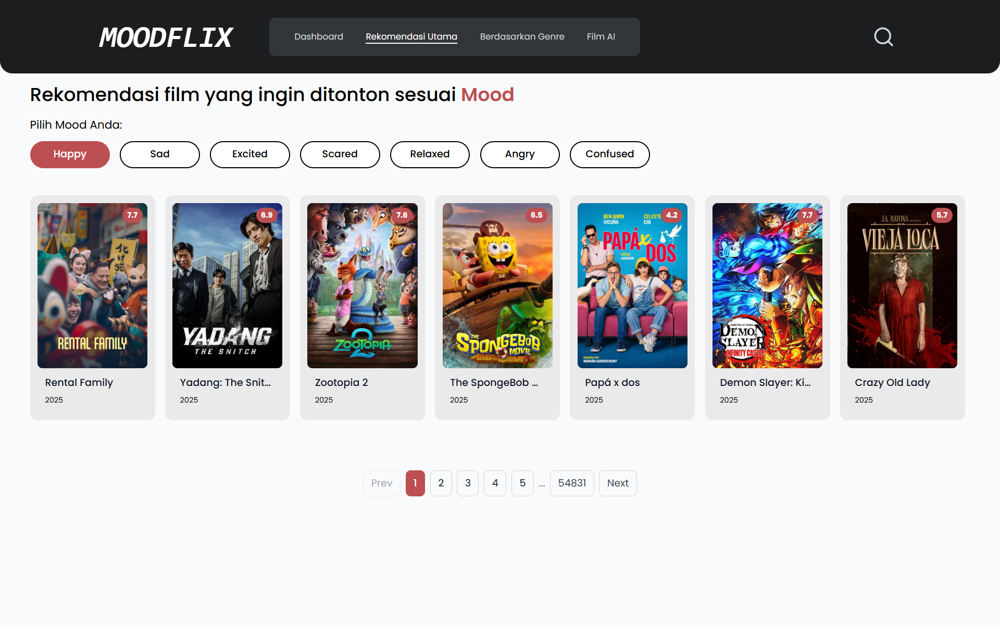
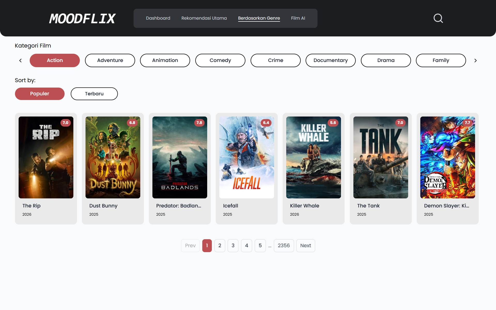
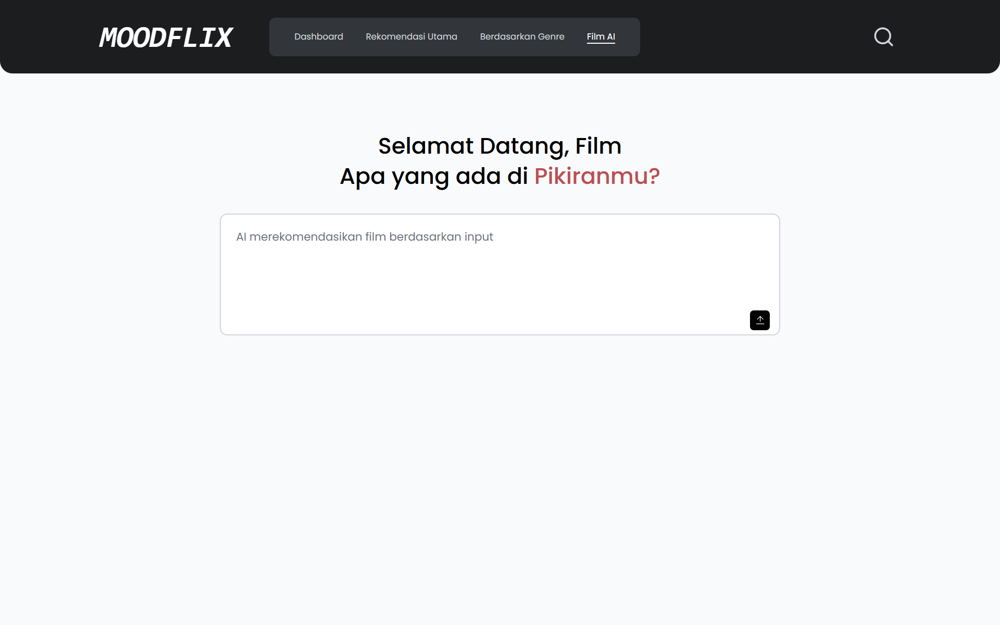
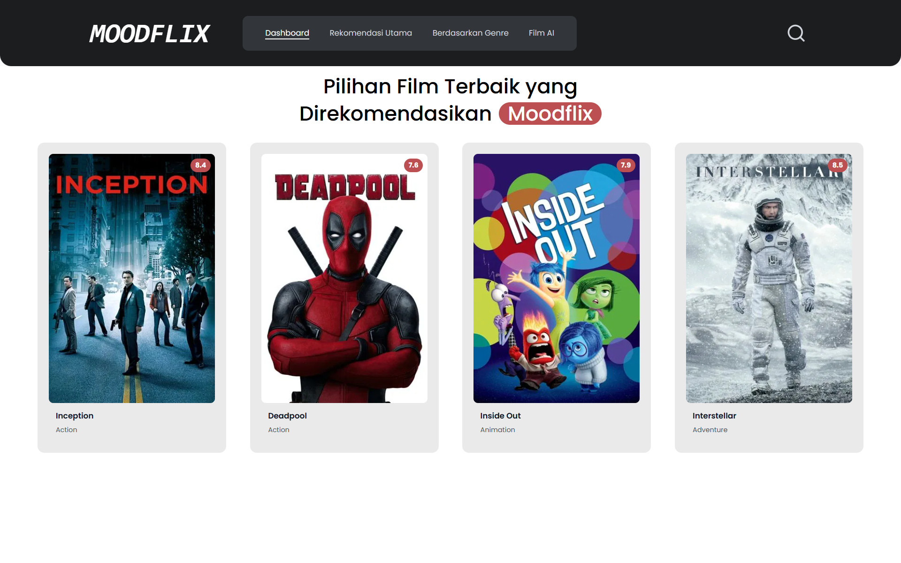

<p align="center"><a href="https://laravel.com" target="_blank"></a></p>

<p align="center">
<a href="https://github.com/laravel/framework/actions"></a>
<a href="https://packagist.org/packages/laravel/framework"></a>
<a href="https://packagist.org/packages/laravel/framework"></a>
<a href="https://packagist.org/packages/laravel/framework"></a>
</p>

## FilmAI — Aplikasi Rekomendasi Film

Proyek ini adalah aplikasi single-page berbasis Laravel + Inertia/React yang memberikan rekomendasi film menggunakan kombinasi metadata TMDB dan layanan AI free-text (DeepSeek). Antarmuka dibuat dengan Tailwind CSS dan dibundel memakai Vite. Aplikasi dirancang sebagai front-end rekomendasi film ringan dengan mode penelusuran berikut:

- Rekomendasi utama berbasis mood (algoritma mood di sisi klien + kartu unggulan).
- Penjelajahan berdasarkan genre dengan kontrol pil horizontal.
- Film AI: input teks bebas yang mengirim kueri ke layanan DeepSeek untuk mendapat saran atau rekomendasi.
- Pencarian cepat (modal) dan tampilan detail film (MovieModal).

Di bawah ini terdapat dokumentasi singkat, petunjuk menjalankan secara lokal, dan screenshot yang ada pada folder `resources/UI`.

### Screenshot

- Rekomendasi Utama



- Berdasarkan Genre



- Film AI (halaman input teks)



- Dashboard



### Teknologi

- Backend: PHP 8.x, Laravel
- Frontend: Inertia.js + React, Vite, Tailwind CSS
- Integrasi eksternal: TMDB (untuk metadata film), DeepSeek (AI free-text)

### Struktur proyek (intinya)

- `resources/js/Pages` — halaman React utama (`FilmAI`, `RekomendasiUtama`, `BerdasarkanGenre`, `Dashboard`).
- `resources/js/Components` — komponen yang dapat digunakan ulang (`SearchInput`, `MovieCard`, `Modal`, `MovieModal`, dll.).
- `app/Http/Controllers` — controller Laravel untuk route API.
- `app/Services/TMDBService.php` — helper integrasi TMDB.
- `resources/UI` — screenshot yang dipakai dokumentasi ini.

## Menjalankan secara lokal (pengembangan)

Persiapan: PHP 8.x, Composer, Node 16+/npm atau Yarn, (opsional) MySQL.

1) Install dependensi PHP:

```powershell
composer install
```

2) Install dependensi JS dan build aset:

```powershell
npm install
npm run dev
```

3) Konfigurasi environment

Salin `.env.example` menjadi `.env` dan atur variabel penting. Contoh yang diperlukan untuk fitur AI:

```dotenv
# Endpoint DeepSeek (pastikan berisi path endpoint, mis. /v1/query jika diperlukan)
DEEPSEEK_API_URL=https://api.deepseek.com/v1/query
DEEPSEEK_API_KEY=sk-xxxxxxxxxxxxxxxxxxxxxxxxxxxxxxxx

# TMDB API key untuk metadata film
TMDB_API_KEY=your_tmdb_api_key
```

Catatan:
- Pastikan `DEEPSEEK_API_URL` menunjuk ke endpoint lengkap yang menerima POST JSON. Jika hanya diberikan domain root tanpa path, sering mengakibatkan respon kosong atau 404.
- Jangan pernah meng-commit `DEEPSEEK_API_KEY` atau kunci sensitif lainnya.

4) Generate aplikasi key dan jalankan migrasi (opsional jika menggunakan database):

```powershell
php artisan key:generate
php artisan migrate
```

5) Jalankan server lokal:

```powershell
php artisan serve
```

Buka `http://127.0.0.1:8000` lalu buka halaman Film AI untuk menguji input teks bebas.

## Film AI — cara kerja singkat

- Pada halaman Film AI, `SearchInput` mengirim kueri teks ke endpoint proxy server: `POST /api/recommendations/deepseek`.
- Endpoint proxy ada di `RecommendationController::deepseekQuery()` dan meneruskan (forward) permintaan ke `DEEPSEEK_API_URL` menggunakan header `Authorization: Bearer <DEEPSEEK_API_KEY>` sehingga kunci tetap aman di server.
- Jika layanan upstream mengembalikan error, proxy membalas dengan `status` dan potongan `body` (truncated) untuk membantu debugging tanpa menampilkan kunci.

## Troubleshooting singkat

- Hasil AI kosong: Periksa apakah `DEEPSEEK_API_URL` sudah benar termasuk path yang diperlukan (mis. `/v1/query`) dan pastikan `DEEPSEEK_API_KEY` valid.
- Uji proxy langsung dengan `curl` untuk melihat respon mentah dari layanan DeepSeek:

```bash
curl -i -X POST http://127.0.0.1:8000/api/recommendations/deepseek \
	-H "Content-Type: application/json" \
	-d '{"q":"cari film komedi romantis terbaru"}'
```

Jika respon berisi `success: false` dan `status`/`body`, gunakan informasi tersebut untuk menyesuaikan URL atau format permintaan ke DeepSeek.

## Catatan pengembang

- Animasi UI dan mount logic ada di `resources/js/Pages` (mis. variabel `initialMounted` untuk animasi satu-kali pada load).
- Logika rekomendasi berbasis mood berada di `resources/js/utils/moodRecommender.js`.

## Kontribusi

Jika ingin berkontribusi, buka issue terlebih dahulu dan sertakan screenshot untuk perubahan UI. Buat commit kecil dan deskriptif.

## Lisensi

Ikuti lisensi paket yang digunakan oleh proyek serta ketentuan layanan API pihak ketiga.

---

Gambar screenshot yang dipakai berada di `resources/UI`.
---

Screenshots used above are located under `resources/UI` in this repository.

Laravel is a web application framework with expressive, elegant syntax. We believe development must be an enjoyable and creative experience to be truly fulfilling. Laravel takes the pain out of development by easing common tasks used in many web projects, such as:

- [Simple, fast routing engine](https://laravel.com/docs/routing).
- [Powerful dependency injection container](https://laravel.com/docs/container).
- Multiple back-ends for [session](https://laravel.com/docs/session) and [cache](https://laravel.com/docs/cache) storage.
- Expressive, intuitive [database ORM](https://laravel.com/docs/eloquent).
- Database agnostic [schema migrations](https://laravel.com/docs/migrations).
- [Robust background job processing](https://laravel.com/docs/queues).
- [Real-time event broadcasting](https://laravel.com/docs/broadcasting).

Laravel is accessible, powerful, and provides tools required for large, robust applications.

## Learning Laravel

Laravel has the most extensive and thorough [documentation](https://laravel.com/docs) and video tutorial library of all modern web application frameworks, making it a breeze to get started with the framework.

You may also try the [Laravel Bootcamp](https://bootcamp.laravel.com), where you will be guided through building a modern Laravel application from scratch.

If you don't feel like reading, [Laracasts](https://laracasts.com) can help. Laracasts contains thousands of video tutorials on a range of topics including Laravel, modern PHP, unit testing, and JavaScript. Boost your skills by digging into our comprehensive video library.

## Laravel Sponsors

We would like to extend our thanks to the following sponsors for funding Laravel development. If you are interested in becoming a sponsor, please visit the [Laravel Partners program](https://partners.laravel.com).

### Premium Partners

- **[Vehikl](https://vehikl.com/)**
- **[Tighten Co.](https://tighten.co)**
- **[WebReinvent](https://webreinvent.com/)**
- **[Kirschbaum Development Group](https://kirschbaumdevelopment.com)**
- **[64 Robots](https://64robots.com)**
- **[Curotec](https://www.curotec.com/services/technologies/laravel/)**
- **[Cyber-Duck](https://cyber-duck.co.uk)**
- **[DevSquad](https://devsquad.com/hire-laravel-developers)**
- **[Jump24](https://jump24.co.uk)**
- **[Redberry](https://redberry.international/laravel/)**
- **[Active Logic](https://activelogic.com)**
- **[byte5](https://byte5.de)**
- **[OP.GG](https://op.gg)**

## Contributing

Thank you for considering contributing to the Laravel framework! The contribution guide can be found in the [Laravel documentation](https://laravel.com/docs/contributions).

## Code of Conduct

In order to ensure that the Laravel community is welcoming to all, please review and abide by the [Code of Conduct](https://laravel.com/docs/contributions#code-of-conduct).

## Security Vulnerabilities

If you discover a security vulnerability within Laravel, please send an e-mail to Taylor Otwell via [taylor@laravel.com](mailto:taylor@laravel.com). All security vulnerabilities will be promptly addressed.

## License

The Laravel framework is open-sourced software licensed under the [MIT license](https://opensource.org/licenses/MIT).
